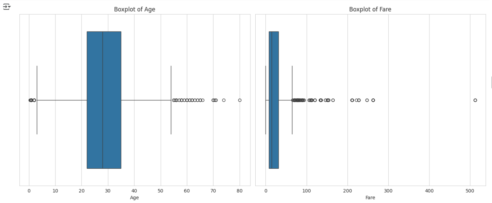
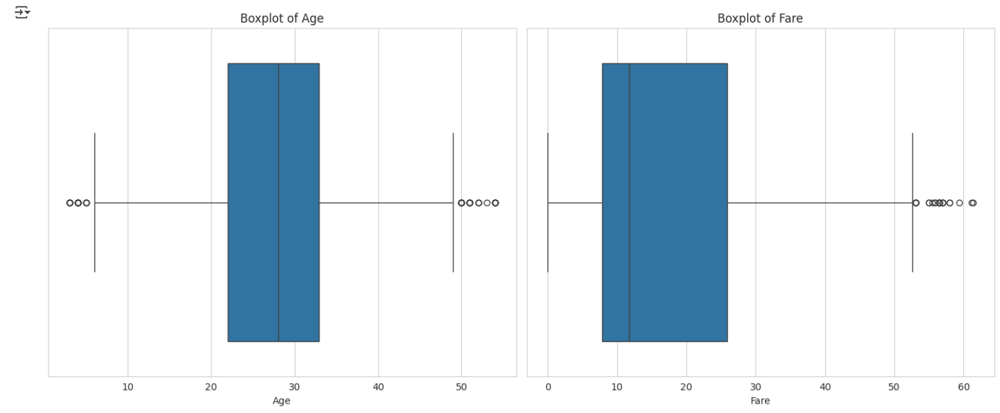
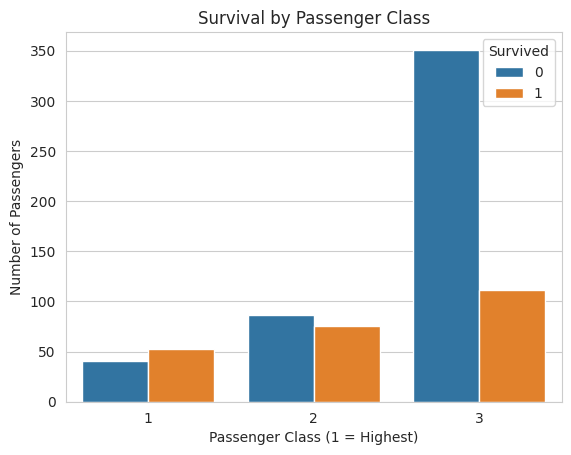
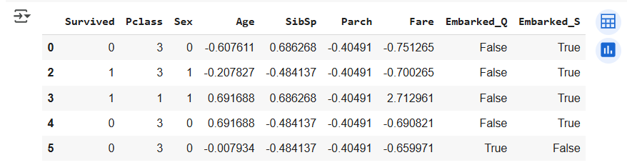

# Task 1 - Data Cleaning & Preprocessing | Elevate Labs Internship

## 📌 Objective
This project involves cleaning and preparing the Titanic dataset using real-world data preprocessing steps. The goal is to make the dataset machine learning–ready by handling missing values, encoding, outlier removal, and feature scaling — just like it’s done in the industry, to have a good practice beforehand.

---

## 📁 Dataset
- [Titanic Dataset – Kaggle](https://www.kaggle.com/datasets/yasserh/titanic-dataset)

---

## 🔧 Steps Performed

1. **Explored the dataset** and checked for missing values
2. **Handled missing values**:
   - `Age`: Filled with median
   - `Embarked`: Filled with mode
3. **Dropped columns** that were irrelevant or too messy:
   - `Cabin`, `Name`, `Ticket`, `PassengerId`
4. **Encoded categorical variables**:
   - `Sex`: Label Encoding
   - `Embarked`: One-Hot Encoding
5. **Detected and removed outliers** using IQR method
6. **Scaled features** using StandardScaler:
   - `Age`, `Fare`, `SibSp`, `Parch`
7. **Visualizations (Extra)**:
   - Boxplots for outlier detection
   - Correlation heatmap
   - Survival count by class (revealed insightful patterns)

---

## 📊 Final Features
Final dataset includes these columns:
- `Survived`, `Pclass`, `Sex`, `Age`, `SibSp`, `Parch`, `Fare`, `Embarked_Q`, `Embarked_S`

All features are numeric, clean, and ready for modeling.

---

## 📊 Visuals

### Boxplot (Age)

### Correlation Heatmap

### Survival by Class

### Final Cleaned Dataset

---

## ✨ Going the Extra Mile
Even though real-world projects may use only 1–2 plots for outliers, I chose to add a few more visualizations to:
- Apply what I learned in my MSc in AI/ML
- Practice storytelling with data
- Show my effort and learning during this internship

---

## 🙋‍♀️ About Me
I'm **Jaaie**, an IT graduate currently reskilling through Elevate Labs' AI/ML internship.  
Though I had an academic background, I wanted to relearn from the ground up — this project is my hands-on beginning with real industry-style work.

---

## 🔗 Submission
This project is submitted as part of the **Elevate Labs AI/ML Internship – Task 1**.

